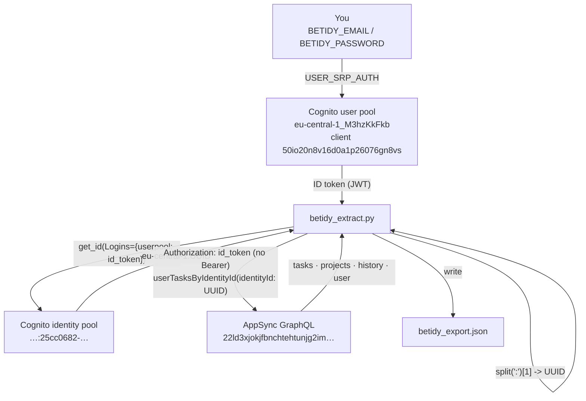

# How it works — reverse-engineering the BeTidy backend

BeTidy (`io.betidy.BeTidy`) is an Android chores / cleaning-schedule app. It has **no
export feature** and no documented API: your tasks, rooms, completion history and
profiles live only inside the app and its cloud backend. This document explains how
`betidy_extract.py` gets that data back out — how the backend was discovered, how it
is put together, and the two non-obvious things you have to get right for the export
to actually return your data.

> **Ethics & scope.** This toolkit is an unofficial client for **your own account**.
> It authenticates with credentials *you* supply and reads only records that belong to
> your own identity. The AWS identifiers below are **public app configuration** —
> shipped in clear text inside the freely downloadable APK, identical for every BeTidy
> user, and not secrets. Use this only with an account you own, respect BeTidy's Terms
> of Service, and note there is **no warranty** (see `LICENSE`). Don't use it to access
> anyone else's data.

---

## 1. The app is a thin client

BeTidy is built on **AWS Amplify**. The app itself contains almost no server logic — it
signs the user in against **AWS Cognito** and then reads and writes its data through an
**AWS AppSync GraphQL** API backed by DynamoDB (with images in S3). That is good news
for data portability: if we can reproduce the sign-in and speak the same GraphQL, we can
pull everything the app can see.

Because there's no published API, the configuration had to be recovered from the app
package.

### How the backend was discovered

1. **Download the APK.** BeTidy is freely downloadable, so the shipping `.apk` is
   obtainable without any special access.
2. **Decompile with [jadx](https://github.com/skylot/jadx).** `jadx` turns the APK's
   Dalvik bytecode back into readable Java and unpacks the bundled resources.
3. **Read the Amplify config resources.** Amplify apps embed their entire backend wiring
   as JSON resources:
   - `res/raw/amplifyconfiguration.json` — the AppSync GraphQL endpoint, region, and
     default authorization mode.
   - `res/raw/awsconfiguration.json` — the Cognito **user pool**, **app client**, and
     **identity pool** identifiers, plus the S3 bucket used for images.
4. **Inspect the generated DataStore models.** Amplify code-generates one Java class per
   data model under
   `com/amplifyframework/datastore/generated/model/`. Reading these gives the exact
   model names, every field, and their types:
   - `User`, `UserTask`, `UserProject`, `TaskHistory` — the records for a signed-in
     account.
   - `Guest`, `GuestTask`, `GuestProject` — the pre-account (guest) equivalents the app
     uses before you register.
5. **Read the auth backend code.** The decompiled app class `AuthBackend` revealed the
   one detail no config file spells out: how the app derives the `identityId` it stores
   on every record (see [Gotcha #2](#gotcha-2--identityid-has-the-region-prefix-stripped)).

Everything the extractor needs was reconstructed from those five steps — no traffic
interception required.

---

## 2. Backend architecture

All values below are the public app config extracted in step 3–4 above. They are the
same for everyone and are hard-coded (in the clear) at the top of `betidy_extract.py`.

| Piece | Value | Purpose |
| --- | --- | --- |
| Region | `eu-central-1` | AWS region hosting the backend |
| Cognito **user pool** | `eu-central-1_M3hzKkFkb` | authenticates users; username = email |
| Cognito **app client** | `50io20n8v16d0a1p26076gn8vs` | **public** client, **no secret**, `USER_SRP_AUTH` flow |
| Cognito **identity pool** | `eu-central-1:25cc0682-e76c-4938-b771-489b7067c75e` | federates the user-pool token into an `identityId` |
| **AppSync GraphQL** | `https://22ld3xjokjfbnchtehtunjg2im.appsync-api.eu-central-1.amazonaws.com/graphql` | the data API |
| AppSync auth mode | `AMAZON_COGNITO_USER_POOLS` | send the Cognito **ID token** in the `Authorization` header (**no `Bearer` prefix**) |
| S3 | image bucket (from `awsconfiguration.json`) | before/after project photos; not exported by this tool |

Two Cognito constructs are involved and it's worth being clear about the difference:

- The **user pool** is the directory that verifies your email + password and issues JWTs
  (an **ID token**, an access token, and a refresh token). AppSync is configured to trust
  ID tokens from this pool.
- The **identity pool** takes that user-pool token and hands back a **federated identity
  id** — an AWS-wide identifier of the form `eu-central-1:<uuid>`. BeTidy uses (a
  trimmed form of) this id as the owner key on every record.

---

## 3. The exact auth flow the extractor performs

`betidy_extract.py` reproduces the app's sign-in with three libraries: `pycognito` for
the SRP handshake, `boto3` for the identity-pool call, and plain `requests` for GraphQL.

```
1. SRP login        pycognito.Cognito(USER_POOL, CLIENT_ID, username=email)
                    .authenticate(password=…)                    ->  ID token (JWT)
2. Federate         cognito-identity.get_id(
                        IdentityPoolId=IDENTITY_POOL,
                        Logins={ "cognito-idp.eu-central-1.amazonaws.com/eu-central-1_M3hzKkFkb": id_token })
                                                                 ->  "eu-central-1:<uuid>"
3. Trim prefix      identityId = federatedId.split(":")[1]       ->  "<uuid>"   (see Gotcha #2)
4. Query AppSync    POST /graphql
                    Authorization: <id_token>            (no "Bearer")
                    userTasksByIdentityId(identityId: "<uuid>")  (GSI, see Gotcha #1)
```

Notes on the implementation:

- **Public, unsigned Cognito calls.** The app client has no secret and the sign-in /
  `get_id` operations are public, so the `boto3` clients are created with
  `signature_version=UNSIGNED` — no AWS access keys are needed anywhere.
- **Username is the email.** BeTidy uses email addresses as Cognito usernames.
- **Credentials stay local.** `BETIDY_EMAIL` / `BETIDY_PASSWORD` are read from the
  environment, used only for the SRP exchange, and never written to disk.
- **The ID token is the API key.** AppSync's `AMAZON_COGNITO_USER_POOLS` mode expects the
  raw ID token JWT in the `Authorization` header **without** a `Bearer` prefix. The
  identity pool is used *only* to derive the `identityId`; the GraphQL calls authenticate
  with the user-pool ID token.

Once authenticated, the script pulls each model and writes a single `betidy_export.json`
bundle (`user`, `tasks`, `projects`, `history`).

### Data-flow diagram



Plain-ASCII version of the same flow:

```
  you (email + password)
        |  USER_SRP_AUTH
        v
  Cognito user pool  eu-central-1_M3hzKkFkb  (client 50io20n8v16d0a1p26076gn8vs)
        |  ID token (JWT)
        v
  betidy_extract.py --- get_id(Logins={userpool: id_token}) ---> Cognito identity pool
        ^                                                         eu-central-1:25cc0682-...
        |  federated id  "eu-central-1:<uuid>"                          |
        +---------------------------------------------------------------+
        |  identityId = federatedId.split(":")[1]  ->  "<uuid>"
        v
  AppSync GraphQL  22ld3xjokjfbnchtehtunjg2im.appsync-api.eu-central-1.amazonaws.com
        |  Authorization: <id_token>   (no "Bearer")
        |  userTasksByIdentityId(identityId: "<uuid>")   <- GSI, not list*
        v
  betidy_export.json   { user, tasks, projects, history }
```

---

## 4. The two gotchas

Reproducing the login is the easy half. Two backend details will silently give you an
**empty or never-ending** export if you get them wrong — both were the actual blockers
during reverse engineering.

### Gotcha #1 — don't use `list*`; use the `<model>ByIdentityId` GSI

The generated GraphQL schema exposes several query shapes per model:
`list<Model>`, `get<Model>`, `sync<Model>`, and `<model>ByIdentityId`.

The obvious choice, `listUserTasks`, is a trap. BeTidy is **multi-tenant**: every user's
`UserTask` records share one DynamoDB table, and access is enforced by Amplify
**owner-based authorization**. An unfiltered `listUserTasks` therefore asks DynamoDB to
scan the **entire shared table** and then drops every row that isn't yours. In practice
you get back page after page of **empty `items` with a non-null `nextToken`** — the scan
walks the whole multi-tenant table and effectively never finishes.

The fix is to query by the **`identityId` Global Secondary Index** instead, which reads
only your partition:

```graphql
query Q($id: String!, $limit: Int, $next: String) {
  userTasksByIdentityId(identityId: $id, limit: $limit, nextToken: $next) {
    items { id title type intervalUnit intervalCount todoDate ... }
    nextToken
  }
}
```

The extractor's `by_identity()` helper uses exactly these GSI queries and follows
`nextToken` to completion:

| Model | GSI query used |
| --- | --- |
| `UserTask` | `userTasksByIdentityId` |
| `UserProject` | `userProjectsByIdentityId` |
| `TaskHistory` | `taskHistoriesByIdentityId` |
| `User` | `getUser(identityId: …)` |

**Type subtlety:** on the GSI queries the `identityId` argument is typed **`String!`**,
but on `getUser` it is the primary key and typed **`ID!`**. The script declares each
query variable accordingly (`$id: String!` for the list-by-index queries, `$id: ID!`
for `getUser`) — mixing them up gets the request rejected by AppSync.

### Gotcha #2 — `identityId` has the `region:` prefix stripped

The identity pool returns a federated id **with** its region prefix:

```
eu-central-1:2f8c…-…-…-…-…      <- what get_id() gives you
```

But the value BeTidy actually stores in the `identityId` field of every record is the
**bare UUID after the colon**. This isn't in any config file — it was found in the
decompiled app, where `AuthBackend._convertIdentityId` does literally:

```java
identityId = federatedId.split(":")[1];   // drop "eu-central-1:"
```

So if you query the GSI with the full `eu-central-1:<uuid>` string, it matches nothing
and you get an empty export. The extractor mirrors the app exactly:

```python
federated = ci.get_id(IdentityPoolId=IDENTITY_POOL, Logins={login: id_token})["IdentityId"]
return federated.split(":")[1]   # the part after the colon
```

Get both of these right and `userTasksByIdentityId("<uuid>")` returns your tasks on the
first page.

---

## 5. What you get, and what's next

`betidy_extract.py` writes `betidy_export.json`. From there:

- **`build_exports.py`** turns that bundle into `betidy_tasks.csv`,
  `betidy_history.csv`, `betidy_rooms.csv`, `betidy_profiles.csv` and a `betidy.sqlite`
  database (tables `tasks`, `history`, `rooms`, `profiles`).
- **`donetick_import.py`** optionally imports your tasks into a self-hosted
  [Donetick](https://github.com/donetick/donetick) instance with full fidelity. See
  [`docs/donetick-import.md`](./donetick-import.md) for that mapping and its own set of
  API quirks.

For the exact field list on each BeTidy model, see the extractor's field selections and
[`docs/data-model.md`](./data-model.md).
